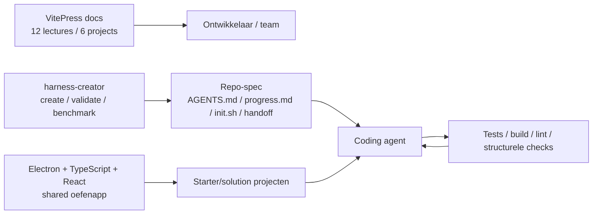
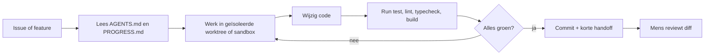
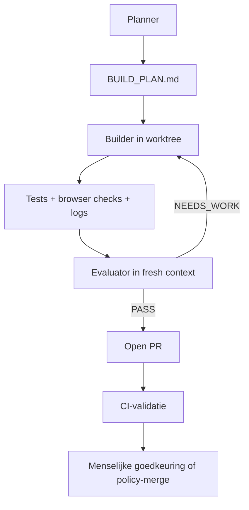

# Onderzoek naar open-source AI-agenten voor softwareontwikkeling

## Executive summary

Het meegegeven repository `github.com/walkinglabs/learn-harness-engineering` is inhoudelijk sterk als **leer- en ontwerpkader** voor agentische softwareontwikkeling, maar het is nadrukkelijk geen volwaardige productieruntime voor coding agents. Het repo positioneert zich als een projectgebaseerde cursus over het ontwerp van de omgeving, state, verificatie en control mechanisms rond AI-coding agents; het bevat 12 colleges, 6 projecten, 14 talen, een VitePress-documentatiesite, een gedeelde Electron/TypeScript/React-oefenapp en een `harness-creator`-skill die een basis-harness kan genereren en structureel kan valideren. Die focus maakt het repo vooral waardevol als **methodologie** en minder als direct inzetbare agent-stack. citeturn31view0turn31view1turn2view0turn32view0

De belangrijkste les uit zowel dit repo als de sterkste primaire bronnen van OpenAI en Anthropic is dat prestatieverbetering bij coding agents zelden alleen uit “een beter model” komt. De grootste winst komt uit **harness design**: repo-lokale instructies, expliciete machine-verifieerbare definitie van done, persistente handoff-artifacts, geïsoleerde runtimes, browser/observability-feedback en een gecontroleerde reviewlus. OpenAI beschrijft hoe een agent-first codebase schaalde naar circa een miljoen regels code en ongeveer 1.500 pull requests zonder handgeschreven code, juist door de repository tot system of record te maken en Codex direct te laten werken met worktrees, browservalidatie en lokale observability. Anthropic laat in twee veldrapporten zien dat initializer-/handoff-patronen en later een planner-generator-evaluator-harness de kwaliteit van langdurige autonome builds sterk verhogen, al gaan daar hogere kosten en latency mee gepaard. citeturn25view0turn25view1turn25view2turn26view0

Het open-source landschap rond deze problematiek is inmiddels duidelijk gelaagd. Voor **dagelijkse developer-productiviteit** zijn Aider, Cline, Goose en OpenCode het meest direct bruikbaar. Voor **autonome issue-oplossing en evaluatie** zijn OpenHands en de SWE-agent-familie relevanter. Voor **duurzame orkestratie en stateful multi-agent workflows** is LangGraph het duidelijkste infrastructuurniveau. Voor **research- of SOP-gedreven multi-agent decompositie** is MetaGPT nog steeds conceptueel belangrijk. Continue blijft relevant als referentie voor source-controlled AI checks in CI, maar het centrale repo is inmiddels read-only en niet langer actief onderhouden. citeturn11view0turn14view0turn13view0turn18view0turn22view0turn16view0turn29view0turn19view0turn30view0

De meest robuuste ontwerpconclusie is paradoxaal: **begin simpeler dan de hype suggereert**. OpenAI adviseert eerst een sterke single-agent baseline met goede tools, evals en prompt-templates; multi-agent orkestratie voeg je pas toe wanneer instructies, toolselectie of taakcomplexiteit aantoonbaar stuklopen. Anthropic zegt expliciet dat de effectiefste agenten vaak met simpele, composable patterns worden gebouwd. Dat wordt extra ondersteund door Agentless en mini-SWE-agent: die laten zien dat lichtere, transparantere scaffolds soms beter of goedkoper presteren dan zwaardere agentische constructies. citeturn36view1turn36view0turn24search3turn29view0

Voor praktijkinzet betekent dit: behandel `learn-harness-engineering` als **curriculum en auditkader**, niet als eindstack. De beste vervolgstap is meestal een combinatie van een directe coding agent in terminal/IDE, een repo-spec (`AGENTS.md`/`CLAUDE.md`), een harde verificatielaag, en pas daarna planner/evaluator-subagents of CI-automatisering. Voor solo-ontwikkeling is dat snel en relatief goedkoop; voor team- en CI-scenario’s stijgen kosten en latency snel. Anthropic rapporteert publieke voorbeeldruns van ongeveer **$200 voor 6 uur** in een zwaardere harness-opzet en **$124,70 voor bijna 4 uur** in een versimpelde variant; OpenAI meldt dat sommige Codex-runs **meer dan zes uur** op één taak werken. Dat bevestigt dat volle autonomie vooral zinvol is voor taken met hoge waarde per run, niet als standaardvervanging van elk PR- of bugfix-proces. citeturn26view0turn25view0

## Analyse van Learn Harness Engineering

De kern van `learn-harness-engineering` is pedagogisch helder: het repo wil ontwikkelaars leren hoe zij de **randvoorwaarden** rond een model ontwerpen, zodat een coding agent betrouwbaar kan werken. In de README wordt het neergezet als een projectgebaseerde cursus over environment, state management, verification en control mechanisms voor AI coding agents, met 12 lectures, 6 practice projects en 14 talen. Het repo verwijst bovendien expliciet naar OpenAI’s en Anthropic’s harness-publicaties als kernreferenties en biedt een `harness-creator`-skill aan om snel een “production-grade harness” te scaffolden. citeturn31view0turn31view1

Architecturaal is het repo **docs-first**, met daarnaast een eenvoudige oefentoepassing. De boomstructuur toont een VitePress-documentatiesite onder `docs/`, per project starter- en solution-varianten onder `projects/`, een gedeelde Electron + TypeScript + React-fundering onder `projects/shared/`, reusable skills onder `skills/`, en repo-/projectspecifieke `CLAUDE.md`-instructies. De package scripts sturen vooral documentatie, README-generatie, locale-synchronisatie en PDF-notes aan; de oefenapp zelf is bewust simpel gehouden met main/preload/renderer/services/shared-modules en lokale opslag. citeturn31view0turn2view0turn2view1turn6search0

De sterkste techniek in het repo is dat het harness-concept **operationaliseerbaar** wordt gemaakt. De `harness-creator`-skill genereert onder meer `AGENTS.md` of `CLAUDE.md`, `feature_list.json`, `progress.md`, `init.sh` en `session-handoff.md`, en valideert vijf subsystemen: instructions, state, verification, scope en lifecycle. Die skill werkt met alleen Node built-ins, ondersteunt meerdere stackfamilies op basisniveau, en kan een HTML-assessmentrapport opleveren. Daarmee verschuift het repo van abstracte theorie naar concrete repo-artifacts die een agent kan lezen en gebruiken. citeturn32view0

Tegelijk zitten hier ook inhoudelijke beperkingen. Het repo valideert de harness **structureel**, maar zegt zelf expliciet dat zo’n score geen vervanging is voor echte before/after agent-session testing. De oefenapp gebruikt mock-Q&A, keyword-based “search”, lokale JSON-/tekstbestanden en geen echte database of LLM-integratie, wat didactisch verdedigbaar is maar de externe validiteit beperkt voor serieuze productieomgevingen. Er zijn bovendien nog geen gepubliceerde releases, en er staat een open issue waarin een gebruiker wijst op interne terminologische inconsistentie tussen het vijf-subsystemenmodel in de lesstof en andere definities elders in het repo. Dat alles bevestigt dat dit repo vooral een **denkraam en starterkit** is, geen afgeronde referentie-implementatie. citeturn32view0turn6search0turn31view1turn28view0turn28view1

Samengevat is mijn oordeel als volgt.

| Aspect | Beoordeling |
|---|---|
| Doel | Sterk en scherp: het repo leert harness engineering als apart engineeringprobleem, niet als prompt-truc. citeturn31view0turn32view0 |
| Architectuur | Goed gekozen voor onderwijs: docs-first plus een eenvoudig, controleerbaar Electron/TS/React-oefenproject. citeturn31view0turn2view1turn6search0 |
| Technieken | Praktisch bruikbaar: repo-specs, progress files, feature lists, init scripts, handoff-artifacts en structurele audits. citeturn32view0 |
| Beperkingen | Geen productieagent, beperkte real-world app-complexiteit, geen releases, en nog niet volledig terminologisch gestabiliseerd. citeturn32view0turn31view1turn28view0turn6search0 |

De onderstaande interpretatieve schets laat zien hoe de onderdelen van het repo logisch op elkaar aansluiten.



Deze schets is een synthese van de repo-structuur, de package scripts en de `harness-creator`-documentatie. citeturn31view0turn2view0turn32view0

## Verwante open-source projecten en frameworks

Wat direct opvalt, is dat de meest relevante projecten niet allemaal hetzelfde probleem oplossen. Sommige zijn **daily-driver coding agents** voor terminal of IDE, andere zijn **frameworks voor orkestratie**, en weer andere zijn **research- of benchmarksystemen**. In relatie tot `learn-harness-engineering` is dat belangrijk: het repo leert vooral hoe je de harness-laag ontwerpt; de onderstaande projecten laten zien hoe die laag in de praktijk wordt gebruikt, geautomatiseerd of gemeten. citeturn31view0turn11view0turn14view0turn16view0turn29view0

| Naam en URL | Licentie | Volwassenheid / activiteit | Taal | Kernfuncties | Hoe dit coding met agents optimaliseert | Integratiepunten |
|---|---|---|---|---|---|---|
| **OpenHands**  `github.com/OpenHands/openhands` | MIT voor core; `enterprise/` heeft afwijkende source-available voorwaarden | Zeer volwassen: 76,4k stars, 6.845 commits, 103 releases, nieuwste release op 2026-06-10 | Python | SDK, CLI, local GUI, cloud, skills, evaluatie-infrastructuur | Geschikt voor end-to-end softwaretaken met lokale of cloud-executie; schaalbaar van lokale run tot duizenden agents | CLI, GUI, REST, modelagnostisch; cloudintegraties met Slack, Jira en Linear. citeturn11view0 |
| **Cline**  `github.com/cline/cline` | Apache-2.0 | Zeer volwassen: 63k stars, 285 releases, nieuwste CLI-release op 2026-06-10 | TypeScript | IDE-extension, CLI, Kanban, SDK, multi-agent teams, scheduled agents | Sterk voor dagelijkse repo-operaties: diff-review, plan/act-scheiding, worktrees, approvals en headless CI/CD | VS Code, JetBrains, CLI, plugins, MCP-servers, Slack/Telegram/Discord, JSON-output voor pipelines. citeturn14view0 |
| **Aider**  `github.com/Aider-AI/aider` | Apache-2.0 | Volwassen: 46k stars, 13.138 commits; openbare tagged release in repo laatst 2025-08-09 | Python | Terminal pair programming, codebase map, git commits, lint/test, IDE-comments, lokale en cloudmodellen | Zeer efficiënt voor “developer-in-the-loop”: kleine tot middelgrote wijzigingen, snelle iteratie en lage setup-frictie | Git, terminal, IDE’s, lokale modellen, webpages/images als context. citeturn13view0 |
| **Goose**  `github.com/aaif-goose/goose` | Apache-2.0 | Zeer actief: 48,7k stars, 137 releases, nieuwste release op 2026-06-03 | Rust | Desktop app, CLI, API, lokale uitvoering, 15+ providers | Sterk voor lokale autonome workflows die verder gaan dan code alleen, maar wel coding, install, edit en test ondersteunen | MCP (70+ extensies), ACP, desktop/CLI/API, cloudproviders en bestaande abonnementen. citeturn18view0 |
| **OpenCode**  `github.com/anomalyco/opencode` | MIT | Zeer actief: 173k stars, 818 releases, nieuwste release op 2026-06-10 | TypeScript | CLI, desktop beta, build/plan agents, subagents, SDK, GitHub-automatisering | Combineert dagelijks coderen met issue-/PR-automatisering; vooral sterk voor GitHub-gedreven comment-to-PR workflows | GitHub Issues/PR’s, schedules en Actions runners; ook MCP-, ACP-, IDE- en SDK-integraties. citeturn22view0turn34view0 |
| **LangGraph**  `github.com/langchain-ai/langgraph` | MIT | Zeer actief: 34,4k stars, 544 releases, nieuwste release op 2026-06-02 | Python | Durable execution, human-in-the-loop, memory, deployment, JS-equivalent | Niet zelf een coding agent, maar dé infrastructuurlaag voor lange, stateful coding- en reviewworkflows | LangChain, LangSmith, LangGraph.js, deployment- en observability-ecosysteem. citeturn16view0turn35search17 |
| **mini-SWE-agent**  `github.com/SWE-agent/mini-swe-agent` | MIT | Jong maar zeer actief: 5,1k stars, 58 releases, nieuwste release op 2026-06-09 | Python | Minimal agent, bash-only, CLI, trajectory browser, Python bindings, sandboxing | Optimaliseert door de scaffold radicaal te vereenvoudigen: betere debugbaarheid, stabielere sandboxing en lagere complexiteit | Lokale envs, Docker/Podman/Singularity, LiteLLM/OpenRouter/andere modelbackends. citeturn29view0 |
| **MetaGPT**  `github.com/FoundationAgents/MetaGPT` | MIT | Conceptueel invloedrijk: 68,7k stars; veel activiteit, maar laatste tagged release in repo is 2024-04-22 | Python | Rolgebaseerde multi-agent “software company”, repo-generatie, CLI en library | Nuttig voor requirement → spec → API → code-decompositie; minder geschikt als lichte daily driver | CLI, Python-library, multi-LLM configuratie via config-bestand. citeturn19view0 |
| **Continue**  `github.com/continuedev/continue` | Apache-2.0 | Groot bereik maar lifecycle-risico: 33,6k stars; repo is read-only en niet langer actief onderhouden | TypeScript | Coding agent als CLI, VS Code-extension en JetBrains-plugin; final 2.0.0 release | Belangrijk als model voor source-controlled AI checks en CI-reviewpaden | CLI, VS Code, JetBrains; focus op checks/CI in docs en repo-positionering. citeturn30view0turn10view3 |

Analytisch zijn hier drie trends zichtbaar. Ten eerste convergeren veel tools op **repo-lokale regels** en **deterministische verificatie**, ook al gebruiken ze verschillende bestandsnamen (`AGENTS.md`, `CLAUDE.md`, `.clinerules`, Continue-configs). Ten tweede verschuift de markt van pure IDE-assistentie naar **volledige workflow-integratie**: GitHub, worktrees, browsercontrole, CI runners, observability en MCP-connectors. Ten derde is onderhoudsstatus inmiddels een serieuze selectievariabele: Continue is read-only en Roo Code is zelfs gearchiveerd en stopgezet, wat laat zien hoe snel deze markt verschuift. citeturn25view0turn14view0turn18view0turn34view0turn30view0turn15view0

## Papers en empirische inzichten

Voor een rigoureuze selectie zijn niet alleen tools relevant, maar ook de evaluatie- en onderzoekslaag. De tabel hieronder combineert academische papers met officiële industry field reports die rechtstreeks gaan over agentische softwareontwikkeling en harness design.

| Paper / rapport | Link | Belangrijkste bevinding | Praktische toepasbaarheid |
|---|---|---|---|
| **OpenAI — Harness engineering: leveraging Codex in an agent-first world** | `openai.com/index/harness-engineering` | OpenAI beschrijft een agent-first codebase die in ongeveer vijf maanden groeide naar orde grootte één miljoen regels code en circa 1.500 PR’s, met de repository als system of record, self-review loops, browservalidatie en lokale observability voor de agent. | Zeer relevant voor teams die verder willen gaan dan “chat met code” en een repo echt agent-ready willen maken. citeturn25view0 |
| **Anthropic — Effective harnesses for long-running agents** | `anthropic.com/engineering/effective-harnesses-for-long-running-agents` | Laat zien dat compaction alleen onvoldoende is voor langlopende coding-taken; initializer-agent, `init.sh`, progress-log en clean handoff-artifacts verhogen de kans op bruikbare multi-session voortgang. | Cruciaal voor taken die langer duren dan één context window, zoals grote refactors of meerdaagse featurebouw. citeturn25view1 |
| **Anthropic — Harness design for long-running application development** | `anthropic.com/engineering/harness-design-long-running-apps` | Introduceert een planner-generator-evaluator-architectuur, benadrukt context resets boven compaction voor sommige modellen, en toont betere outputkwaliteit dan een solo-agent, maar tegen hogere kosten en latency; in publieke voorbeelden lag een run rond $200/6 uur en later $124,70/3u50m. | Relevant zodra je merkt dat single-agent + tools onvoldoende kwaliteit levert op complexe, langdurige builds. citeturn25view2turn26view0 |
| **Jimenez et al. — SWE-bench: Can Language Models Resolve Real-World GitHub Issues?** | `arxiv.org/abs/2310.06770` | Introduceert 2.294 echte GitHub-issues uit 12 Python-repo’s; bij publicatie loste het beste model slechts 1,96% op. De benchmark maakt duidelijk hoe moeilijk real-world software engineering voor LLM’s is. | Onmisbaar als evaluatiekader of als inspiratie voor een eigen interne benchmarkset. citeturn24search0 |
| **Yang et al. — SWE-agent: Agent-Computer Interfaces Enable Automated Software Engineering** | `arxiv.org/abs/2405.15793` | Laat zien dat agent-computer interface design de prestatie sterk beïnvloedt; SWE-agent behaalde volgens het paper 12,5% pass@1 op SWE-bench en 87,7% op HumanEvalFix. | Belangrijk bewijs dat tool- en interfaceontwerp een first-class beslissingsvariabele is, niet alleen modelkeuze. citeturn23search3 |
| **Xia et al. — Agentless: Demystifying LLM-based Software Engineering Agents** | `arxiv.org/abs/2407.01489` | Toont dat een eenvoudiger, niet-volledig-agentische pipeline voor localization, repair en patch validation op SWE-bench Lite 32% haalt voor ongeveer $0,70 en open-source agenten verslaat. | Zeer bruikbaar als reality check: voeg pas complexe agentiek toe als eenvoudige baselines het aantoonbaar niet halen. citeturn24search3 |
| **Hong et al. — MetaGPT: Meta Programming for A Multi-Agent Collaborative Framework** | `openreview.net/forum?id=VtmBAGCN7o` | Verwerkt SOP’s en rolverdeling in promptsequenties, zodat gespecialiseerde agents tussenresultaten kunnen controleren en fouten minder escaleren. | Nuttig voor requirement-analyse, planning en spec-driven ontwikkeling; minder geschikt als lichtgewichte daily-driver. citeturn24search1 |
| **Zhang et al. — AFlow: Automating Agentic Workflow Generation** | `openreview.net/forum?id=z5uVAKwmjf` | Behandelt workflow-optimalisatie als zoekprobleem over code-gerepresenteerde workflows; rapporteert gemiddeld 5,7% winst over state-of-the-art baselines en laat zien dat kleinere modellen op sommige taken GPT-4o kunnen verslaan tegen 4,55% van de kosten. | Belangrijk voor de volgende fase: niet alleen agents bouwen, maar ook de harness/workflow automatisch laten zoeken en tunen. citeturn24search2turn24search18 |

De rode draad uit deze literatuur is consistent. Eerst: **benchmarks bevestigen dat real-world software engineering hard blijft**, ook voor sterke modellen. Daarna: **interface en harness** maken een materieel verschil. En tenslotte: **meer agenten is niet automatisch beter**; eenvoudige, goed geëvalueerde pipelines kunnen soms beter scoren dan complexere agentische systemen. Dat maakt evaluatie en failure attribution belangrijker dan architecturale mode. citeturn24search0turn23search3turn24search3turn24search2

## Best practices voor agentische coding workflows

De onderstaande patronen zijn het meest consistent onderbouwd door primaire bronnen en bruikbaar als ontwerpregels voor een repository of team dat coding agents productiever wil maken.

| Thema | Aanbevolen praktijk | Waarom dit werkt |
|---|---|---|
| **Design van de repository** | Maak de repo de **single source of truth**. Houd `AGENTS.md`/`CLAUDE.md` kort en gebruik het als inhoudsopgave naar versiebeheerbare docs in de repo. | OpenAI rapporteert dat een “groot AGENTS-bestand” slecht schaalt; een korte TOC plus versiebeheerbare docs werkt beter op grote taken en voorkomt contextvervuiling en drift. citeturn25view0 |
| **Definition of done** | Maak “klaar” mechanisch toetsbaar: tests, lint, typecheck, build, browsergedrag en waar nuttig logs/metrics. | Learn Harness Engineering benadrukt verificatie als high-ROI subsystem; Anthropic’s contract- en evaluatorpatroon voorkomt dat een agent te vroeg “done” claimt; OpenAI maakte UI, logs en metrics direct leesbaar voor de agent. citeturn28view1turn27view0turn25view0 |
| **State en continuïteit** | Gebruik `PROGRESS.md`, featurelijsten, commits en handoff-notes; voor langlopende taken liever context resets met handoff-artifacts dan blind vertrouwen op samenvatting/compaction. | Anthropic laat zien dat nieuwe sessies zonder expliciete handoff context verliezen; context resets kunnen bij lange taken beter werken dan compaction, mits de handoff goed is. citeturn25view1turn25view2 |
| **Tooling en tool design** | Gebruik weinig maar scherpe tools; documenteer ze goed, standaardiseer interfaces en hergebruik dezelfde tooldefinities over agents heen. Gebruik waar mogelijk MCP of vergelijkbare open standaarden. | OpenAI adviseert gestandaardiseerde, goed geteste en herbruikbare tools; MCP is juist bedoeld als open specificatie om LLM-clients veilig en consistent aan tools/resources te koppelen. citeturn36view1turn33search0turn33search14 |
| **Prompt engineering** | Werk met **prompt templates en policy variables** in plaats van een wildgroei aan losse prompts. | OpenAI beveelt expliciet een flexibele basisprompt met variabelen aan om onderhoud, evaluatie en schaalbaarheid te vereenvoudigen. citeturn36view1 |
| **Orkestratie** | Maximaliseer eerst een single-agent systeem; voeg planner-, evaluator- of specialist-agents alleen toe wanneer echte failure logs aantonen dat instructiecomplexiteit of tool overload de bottleneck is. | OpenAI adviseert default single-agent met tools; Anthropic en Agentless laten beide zien dat complexiteit alleen zin heeft als zij meetbare lift geeft. citeturn36view1turn36view0turn24search3 |
| **Veiligheid en governance** | Isoleer runs met worktrees/sandboxes, zet hooks of policies in voor deterministische regels, en plaats human approval vóór irreversibele of gevoelige acties. | OpenAI gebruikt worktrees en geïsoleerde observability; Claude Code hooks bieden deterministische lifecycle-controls; LangGraph documenteert HITL voor gevoelige tool calls zoals schrijven, verwijderen of transacties. citeturn25view0turn36view3turn36view2turn35search2turn35search5 |
| **Evaluatie** | Meet op echte taken, niet alleen op synthetische structurele scores. Combineer repo-specifieke regression taken met benchmarkachtige suites en eenvoudige baselines. | `harness-creator` waarschuwt dat structurele scoring geen echte session testing vervangt; SWE-bench en Agentless laten zien hoe groot het verschil kan zijn tussen benchmarkscore, kosten en praktische bruikbaarheid. citeturn32view0turn24search0turn24search3 |
| **Kosten en latency** | Bouw eerst een kwaliteitsbaseline met een sterk model; vervang daarna waar mogelijk door kleinere modellen of lagere-autonomie paden. Her-evalueer je harness bij model-upgrades en verwijder scaffolding die niet meer load-bearing is. | OpenAI adviseert baseline met het capabelste model en daarna downsizing; Anthropic laat zien dat nieuwe modelgeneraties sommige harnesscomponenten overbodig maken en dat versimpeling zinvol is. citeturn36view1turn26view0 |

De praktisch belangrijkste combinatie is naar mijn oordeel deze: **repo-spec + harde verificatie + expliciete handoff + beperkte autonomie + iteratieve evaluatie**. Dat is precies de zone waar `learn-harness-engineering`, de OpenAI-field report en Anthropic’s quickstart elkaar inhoudelijk overlappen. citeturn31view0turn25view0turn27view0

## Mini-workflows en referentiestacks

Een bruikbaar startpunt is een **bounded solo-loop**: één agent, één repo, één feature tegelijk, en een harde definitie van done. Dat past zowel bij de five-subsystem-benadering uit `learn-harness-engineering` als bij de aanbeveling van OpenAI en Anthropic om eerst eenvoud te maximaliseren. citeturn32view0turn36view1turn36view0



Een minimaal repo-contract dat goed aansluit op de onderzochte patronen ziet er bijvoorbeeld zo uit. Dit is geen letterlijk sjabloon uit één bron, maar een compacte synthese van de repo-local instructions, verificatiecommando’s en handoff-artifacts die in de bronnen terugkomen. citeturn25view0turn25view1turn32view0

```md
# Werkcontract voor deze agent

Doel:
- Implementeer exact één item uit feature_list.json

Niet doen:
- Geen schemawijzigingen
- Geen secrets of deploy-stappen
- Geen wijzigingen buiten /src en /tests zonder expliciete reden

Verificatie:
- npm test
- npm run lint
- npm run typecheck
- npm run build

Handoff:
- Werk PROGRESS.md bij
- Noteer blockers in session-handoff.md
- Maak één commit per feature
```

Voor teams met zwaardere taken is een **planner-builder-evaluator**-lus zinvoller. Anthropic liet zien dat zo’n architectuur veel beter kan presteren dan een solo-agent op complexe applicatiebouw, juist omdat planning en evaluatie worden losgetrokken van de builder en omdat de evaluator in een “fresh context” werkt. OpenAI’s eigen praktijk met extra agent reviews en browser-/observability-validatie wijst in dezelfde richting. citeturn25view2turn26view0turn25view0turn27view0



Voor CI/CD is comment- of event-gedreven agentautomatisering nu al praktisch. OpenCode documenteert een GitHub Actions-pad waarbij `/opencode`-comments of PR-events taken uitvoeren binnen GitHub runners. Onderstaande YAML is een vereenvoudigde, aangepaste variant van dat patroon, bruikbaar als referentie-architectuur voor reviewer-agents in CI. citeturn34view0

```yaml
name: agent-review
on:
  pull_request:
    types: [opened, synchronize, reopened]

jobs:
  review:
    runs-on: ubuntu-latest
    permissions:
      id-token: write
      contents: read
      pull-requests: read
      issues: read

    steps:
      - uses: actions/checkout@v6
        with:
          persist-credentials: false

      - uses: anomalyco/opencode/github@latest
        env:
          ANTHROPIC_API_KEY: ${{ secrets.ANTHROPIC_API_KEY }}
          GITHUB_TOKEN: ${{ secrets.GITHUB_TOKEN }}
        with:
          model: anthropic/claude-sonnet-4-20250514
          prompt: |
            Review deze pull request op regressies,
            ongeteste paden en overtredingen van AGENTS.md.
```

Als referentiestacks voor drie veelvoorkomende scenario’s zou ik het volgende aanbevelen.

| Scenario | Aanbevolen stack | Waarom deze combinatie werkt | Voordelen | Nadelen | Kostenindicatie |
|---|---|---|---|---|---|
| **Solo developer** | **Aider** of **Cline/OpenCode** + `AGENTS.md` + `PROGRESS.md` + lokale tests/lint/typecheck + optioneel lokaal model | Geeft maximale snelheid met minimale orkestratiecomplexiteit; sluit aan op de “single agent first”-aanpak | Lage setup-frictie, sterke git/CLI-flow, direct bruikbaar op bestaande repo’s | Onafhankelijke QA ontbreekt standaard; kwaliteit hangt nog sterk af van repo-hygiëne | **Laag tot middel**: OSS-tools zelf zijn vrij beschikbaar; modelkosten variëren of zijn niet publiek eenduidig gespecificeerd. citeturn13view0turn14view0turn22view0turn36view1 |
| **Team / productontwikkeling** | **OpenHands** of **Cline SDK** + **LangGraph** + browsercontrole (Playwright/MCP) + observability + planner/evaluator + Slack/Jira/Linear | Sterk voor lange, complexe taken, parallelle sessies en gedeelde zichtbaarheid | Durable state, multi-agent decompositie, betere traceerbaarheid, integratie in teamtools | Meer infrastructuurwerk, meer governance nodig, hogere latency en spend | **Middel tot hoog**: publieke Anthropic-voorbeelden voor zware autonome runs lagen rond $124,70–$200 per run; overige model- en infra-kosten zijn taakafhankelijk. citeturn11view0turn14view0turn16view0turn25view2turn26view0 |
| **CI/CD-integratie** | **OpenCode GitHub Action** of **headless Cline CLI** of **Continue-style checks** + GitHub Actions + minimaal permissiemodel + menselijke mergegate | Goed voor PR-review, issue triage, scheduled chores en beperkte autofixes | Auditbaar, repeatable, schaalbaar, eenvoudig aan bestaande CI te hangen | Secretbeheer, runnerkosten, risico op ruis of slechte fixes zonder guardrails | **Laag tot middel** voor review-only; **middel tot hoog** voor fix-and-PR loops. OSS-tooling is beschikbaar, maar model- en CI-kosten blijven variabel. citeturn34view0turn14view0turn30view0turn26view0 |

Mijn concrete aanbeveling, startend vanuit `learn-harness-engineering`, is daarom: **bouw eerst een repo-spec en verificatielaag, kies daarna één dagelijkse agent, en voeg pas daarna duurzame orkestratie of CI-automatisering toe**. Anders gezegd: optimaliseer eerst de harness, pas daarna de agent. citeturn31view0turn32view0turn25view0turn36view1

## Gaten, risico’s en open onderzoeksvragen

| Thema | Wat het gat of risico is | Waarom dit telt |
|---|---|---|
| **Benchmarkrealisme** | Hoge scores op SWE-bench of interne structurele harnessscores garanderen nog geen winst in jouw eigen repo. | `harness-creator` waarschuwt zelf dat structurele scoring geen vervanging is voor echte session testing; SWE-bench toont vooral moeilijkheid en vergelijkbaarheid, niet automatisch productiewaarde. citeturn32view0turn24search0 |
| **Overcomplexiteit** | Multi-agent architecturen voegen latency, tokenverbruik en debuggingcomplexiteit toe, terwijl eenvoudigere pipelines soms beter of goedkoper presteren. | Agentless en mini-SWE-agent verschuiven de baseline richting eenvoud; Anthropic benadrukt bovendien dat je load-bearing harnesscomponenten moet herbeoordelen na modelupgrades. citeturn24search3turn29view0turn26view0 |
| **Verificatieblinde vlekken** | UI/UX, edge cases en subjectieve kwaliteit blijven moeilijk; builders beoordelen hun eigen werk vaak te rooskleurig. | Anthropic beschrijft expliciet dat evaluators aanvankelijk oppervlakkig testten of fouten wegredeneerden; daarom zijn fresh-context evaluators, Playwright en rubrics zo belangrijk. citeturn25view2turn27view0 |
| **Veiligheid en machtigingen** | Hoe meer een agent mag schrijven, uitvoeren, browsen of PR’s openen, hoe groter de kans op onbedoelde of ongewenste acties. | OpenAI behandelt tools en computer-use als kernonderdeel van agents; Claude hooks en LangGraph HITL laten zien dat deterministische regels en menselijke goedkeuring noodzakelijk zijn bij gevoelige acties. citeturn36view1turn36view3turn35search2turn35search5 |
| **Onderhoudsvolatiliteit van tools** | De open-source agentmarkt verschuift snel; projecten kunnen van koers veranderen, read-only worden of verdwijnen. | Continue is read-only en niet langer actief onderhouden; Roo Code is gearchiveerd en stopgezet. Toolkeuze is dus ook een lifecycle- en governancebeslissing. citeturn30view0turn15view0 |
| **Kosten en latency-plafond** | Volledig autonome app-bouw blijft traag en duur in publieke voorbeelden. | OpenAI noemt runs van meer dan zes uur; Anthropic publiceert runs van meerdere uren en kosten in de orde van honderden dollars. Daardoor is taakselectie essentieel. citeturn25view0turn26view0 |

De belangrijkste open onderzoeksvragen zijn naar mijn oordeel deze. Wanneer is een planner/evaluator-harness **vooraf** voorspelbaar rendabel, in plaats van pas achteraf? Hoe vertaal je benchmarkwinst naar polyglotte monorepo’s met front-end, back-end, infra en compliance tegelijk? Hoe maak je handoff-artifacts en definitions of done grotendeels automatisch zonder dat zij binnen weken verouderen? En hoe meet je niet alleen “issues opgelost”, maar ook **correctiekosten, reviewlast, regressierisico en menselijke interrupties** per waardevolle changetype? De onderzochte bronnen geven hiervoor sterke bouwstenen, maar nog geen algemeen geldige antwoorden. citeturn24search0turn24search2turn25view0turn26view0turn32view0